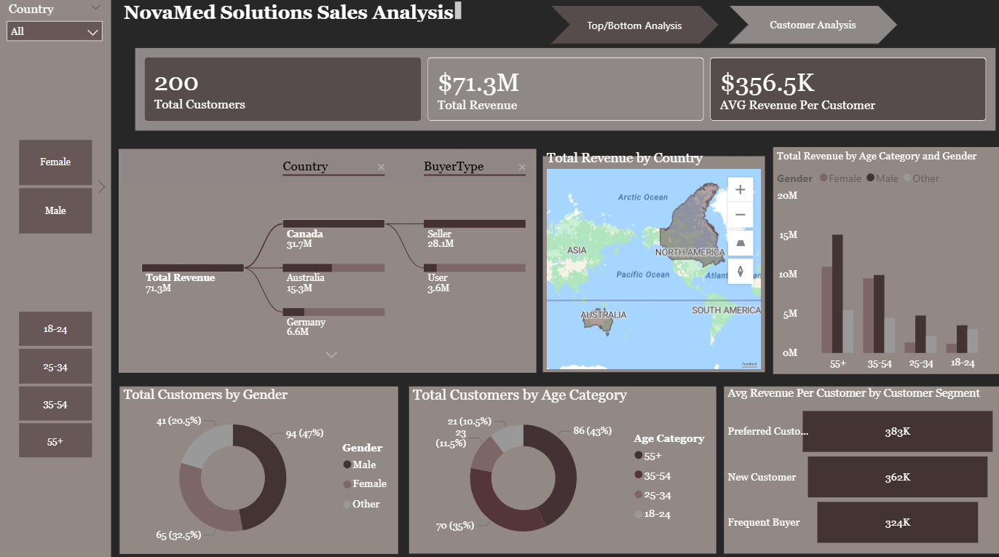

NovaMed Solutions Sales Analysis Dashboard

This project presents an end-to-end sales and customer analytics dashboard built in Power BI for NovaMed Solutions, a pharmaceutical distribution company.

The dashboard provides insights into revenue performance, customer segmentation, product profitability, and geographic trends to support data-driven decision-making.

📊 Key Features

Revenue Overview

*Total Revenue: $71.3M
*Profit: $58.5M
*Profit Margin: 82.0%
*Quantity Sold: 269K units

Customer Insights
Total Customers: 200
Average Revenue per Customer: $356.5K
Customer segmentation (Preferred, New, Frequent Buyers)
Gender and age distribution analysis
Sales Performance Analysis
Monthly revenue and profit trends
Country-level revenue breakdown
Buyer type analysis (Seller vs User)
Product Performance
Top 5 and Bottom 5 drugs by revenue
Profit contribution by drug name
Interactive Filters
Country
Gender
Age group
Buyer type
🧰 Tools & Technologies
Power BI (Data Modeling & Visualization)
DAX (Measures & KPIs)
Data Cleaning & Transformation (Power Query)
📁 Dataset Overview

The project uses:

Fact table (sales transactions)
Customer dataset
Drug lookup table
🎯 Objectives
Identify top-performing products and customers
Analyze profitability trends
Understand customer demographics and behavior
Provide actionable business insights
📸 Dashboard Preview

🚀 Key Insights
High profit margin (82%) indicates strong pricing strategy
Top drugs dominate revenue contribution
Older age groups (55+) generate the highest revenue
Sellers contribute significantly more revenue than users
📌 Future Improvements
Add forecasting models
Include regional sales trends over time
Enhance drill-through capabilities
Integrate real-time data sources
📊 Insights & Recommendations Report
🔍 1. Revenue & Profitability Analysis
Total Revenue: $71.3M
Profit: $58.5M
Profit Margin: 82%
Insight:

This is an unusually high margin, suggesting:

Strong pricing power
Low cost of goods relative to selling price
Recommendation:
Validate sustainability of this margin
Consider reinvesting excess profit into:
R&D
Market expansion
Customer acquisition
👥 2. Customer Analysis
Total Customers: 200
Avg Revenue per Customer: $356.5K
Insight:
Revenue is highly concentrated per customer
Indicates reliance on fewer high-value clients
Recommendation:
Reduce dependency risk by:
Expanding customer base
Targeting mid-tier clients
Implement loyalty programs for top customers
👤 3. Customer Segmentation
Preferred Customers: Highest avg revenue (~383K)
New Customers: ~362K
Frequent Buyers: ~324K
Insight:
Preferred customers are the most valuable segment
Frequent buyers generate less revenue per customer
Recommendation:
Upsell to frequent buyers
Convert new customers → preferred customers
Personalized marketing strategies
🌍 4. Geographic Performance

Top countries:

Canada (~31.7M)
Australia (~15.3M)
Germany (~6.6M)
Insight:
Revenue is heavily concentrated in Canada
Recommendation:
Diversify geographically
Increase marketing in underperforming regions
Investigate why Canada performs best and replicate
💊 5. Product Performance

Top Drugs:

Doxycycline (~3.3M)
Ergocalciferol (~3.2M)
Lisinopril (~3.1M)

Bottom Drugs:

Warfarin (~0.2M)
Montelukast (~0.4M)
Insight:
A few drugs dominate revenue (Pareto effect)
Recommendation:
Focus marketing on top-performing drugs
Reassess low-performing products:
Improve pricing
Bundle them
Or discontinue
📈 6. Monthly Trends
Insight:
Revenue and profit fluctuate but remain stable
No extreme seasonal spikes
Recommendation:
Introduce seasonal campaigns to boost weak months
Use forecasting to anticipate demand
🎯 7. Demographics (Age & Gender)
Age 55+ contributes the most revenue
Male customers slightly dominate
Insight:
Older demographic is the primary revenue driver
Recommendation:
Target older populations with tailored campaigns
Explore growth opportunities in younger segments
⚖️ 8. Buyer Type Analysis
Sellers contribute significantly more revenue than users
Insight:
B2B channel is stronger than direct consumers
Recommendation:
Strengthen partnerships with sellers
Expand distributor network
Offer bulk incentives
🧠 Final Strategic Takeaways
Revenue is strong but concentrated (customers + geography + products)
Business is highly profitable but potentially risky if key segments drop
Growth opportunity lies in:
Diversification
Customer expansion
Product optimization
